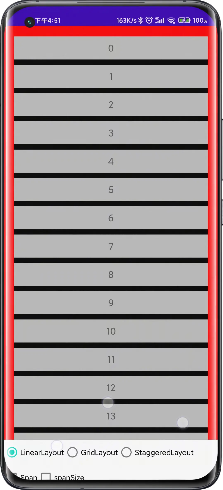
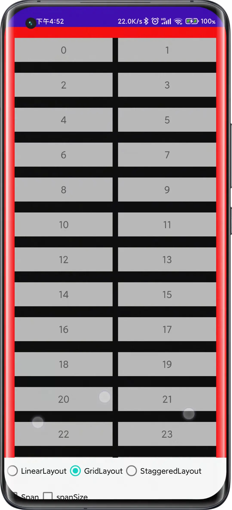
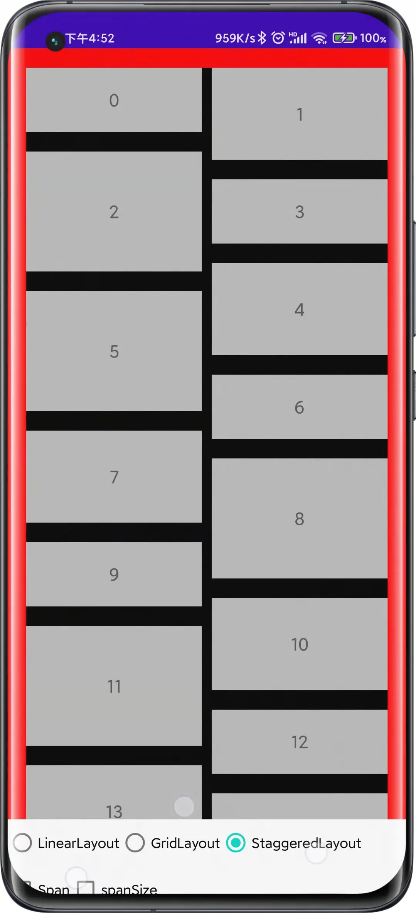
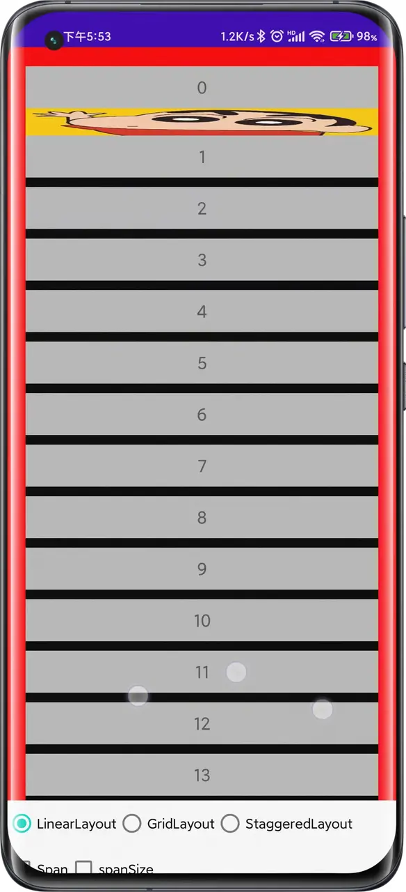

### 使用说明
SimpleDecoration 是一个通用的分割线，适配了官方的3种LayoutManager，并提供了一些便利的方法。

### 基本使用
```kotlin
// 创建 SimpleDecoratoin 
val decoration = SimpleDecoration
  .Builder()
  .setSize(size)  // 分割线大小，默认 lineSize == size
  .setLineSize(size * 2) // 纵轴的size，适用于 GirdLayout & StaggeredGridLayout
  .setColor(Color.BLACK) // 分割线颜色
  .setHorizontalEdge(size * 2) // 水平的间隔
  .setVerticalEdge(size * 2) // 竖直的间隔
  .setEdgeColor(Color.RED) // 间隔的颜色
  .build() // 创建
  
// 添加到recyclerView中    
addItemDecoration(item)
```

通过上面的简单设置即可实现，分割线的设置，间距的设置，并且内部自动根据设置，处理三种布局的绘制与分割。
效果图如下所示：
<div align ='center'>
     
</div>

### 拦截器
上述的功能基本能满足日常开发需求，但是有一些特殊场景：
- 列表添加了Header或者是Footer，不需要分割线
- Header & Footer需要的间距和列表Item的间距不一致
- Header & Footer需要的间距和列表Item的分割线样式不一致

这种场景下，SimpleDecoratoin提供了绘制拦截器和间距拦截器。

// 创建 SimpleDecoratoin 
val decoration = SimpleDecoratoin
  .Builder()
  .setSize(size)  // 分割线大小，默认 lineSize == size
  .setLineSize(size * 2) // 纵轴的size，适用于 GirdLayout & StaggeredGridLayout
  .setColor(Color.BLACK) // 分割线颜色
  .setHorizontalEdge(size * 2) // 水平的间隔
  .setVerticalEdge(size * 2) // 竖直的间隔
  .setEdgeColor(Color.RED) // 间隔的颜色
  // 拦截器 -- 间距，因为水平分割线，设置的下一个item的top，所以postion是 1
  .setInterceptOffsetListener { outRect, position, direction ->
  if (position == 1) {
    // 底部间距重置，变为100
    outRect.top = 100
  }
  position == 1 // 拦截 0 pos
}
// 拦截器 -- 绘制
.setInterceptDraw { c, rect, paint, position, direction ->
  if (position == 1) {
   // 绘制的范围修改，默认分割线范围，top增大
    rect.bottom = rect.top + 100
    val bit = BitmapFactory.decodeResource(resources, R.drawable.labi)
    c.drawBitmap(bit, null, rect, paint)
  }
  position == 1 // 拦截 0 pos
}
  .build() // 创建
  
// 添加到recyclerView中    
addItemDecoration(item)

效果图如下所示：
<div align ='center'>
  
</div>


### 目前现有的问题
如果设置了StaggeredGridLayoutManager/FullSapn & GridLayoutManager/SpanSizeLook，目前显示的分割线颜色可能会存在问题，因为Decoration本质是装饰器，不是分割线，是在每一个Item上面进行分割。
